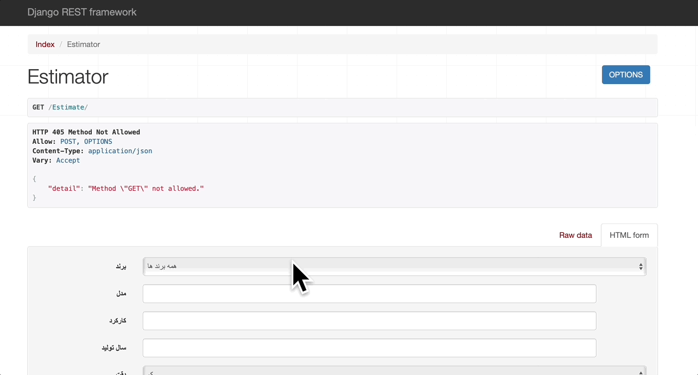

# Car Price Estimator

This Django project uses car data to estimate the price of the car you want by using machine learning, using the data of the vehicles extracted from the Divar site.



# How to run (Linux and Macos)

To run project in development mode; Just use steps below:

1. Install python, pip, virtualenv in your system.
2. Clone the project https://github.com/Shntia/CarPriceEstimator.git
3. Make development environment ready using commands below;
```sh
   git clone https://github.com/Shntia/CarPriceEstimator.git && cd CarPriceEstimator
  python3 -m venv env  # Create virtualenv named env
  source build/bin/activate
  pip install -r requirements.txt
  python manage.py makemigrations
  python manage.py migrate  # Create database tables
   ```
4. Run project using python manage.py runserver
5. Go to http://localhost:8000 to see project.

## Run On Windows

If You're On A Windows Machine , Make Environment Ready By Following Steps Below:
1. Install `python`, `pip`, `virtualenv` 
2. Clone the project using:  `git clone https://github.com/Shntia/CarPriceEstimator.git`.
3. Make Environment Ready Like This:
``` Command Prompt
cd CarPriceEstimator
virutalenv -p "PATH\TO\Python.exe" build # Give Full Path To python.exe
build\Scripts\activate # Activate The Virutal Environment
pip install -r requirements.txt
move CarPriceEstimator\settings.py.sample CarPriceEstimator/settings.py
python manage.py makemigrations
python manage.py migrate # Create Database Tables
```
4. Run `CarPriceEstimator` using `python manage.py runserver`
5. Go to [http://localhost:8000](http://localhost:8000) to see CarPriceEstimator projet.


## TODO
- [ ] Build a Front-End For This API
